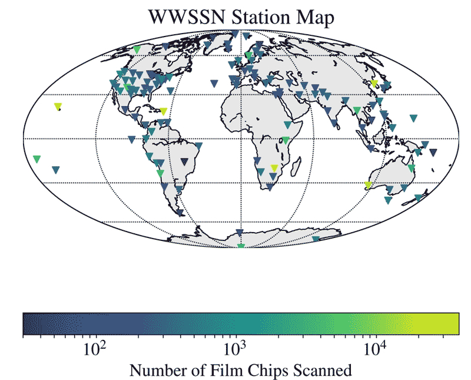

The World-Wide Standardized Seismographic Network (WWSSN) provided continuous data from approximately 100 stations around the world beginning in 1961 with station ASL. High quality, continuous data were recorded on standardized instrumentation with accurate clocks. Deployment and operation of the WWSSN was initially done by the U.S. Coast and Geodetic Survey (C&GS) and later transferred from the National Oceanic and Atmospheric Administration (successor to the administrative agency for C&GS) to the U.S. Geological Survey. Network support was terminated in 1996. Some of the stations remain closed while others have been upgraded with new digital recording equipment.

## Stations

Over 100 stations worldwide beginning in 1961 through 1996.

See Peterson and Hutt (2014) for a list of stations installed.

## Instrumentation
* 3 component, Benioff short‐period sensors
* 3 component, Sprengnether Press‐Ewing long‐period sensors

See Petersen and Hutt (2014).

## Recording Medium
300 x 900 mm paper seismograms photographed to:
*	film chip (70 by 120 mm)
*	Microfiche (24 per sheet)
*	film rolls (156, 35mm)

## Data Availability
Several organizations hold partial or (mostly) complete sets of photographed data:
* Albuquerque Seismological Laboratory: Microfiche through June 1979, film chips: 1962 through June 1978 (complete)
* Lamont–Doherty Earth Observatory: film chips (complete) *includes California Institute of Technology collection merged in 2010*
* Northwestern University: film chips (partial)
* British Geological Survey: film chips (unknown), microfiche from 1978-1990 (complete)
* [Earthquake Research Institute](http://wwweic.eri.u-tokyo.ac.jp/wwssn/filmlist.html): microfilms for 167 stations from 1963-1988 (16,100 rolls) (Satake et al., 2020)

Scans of all available records were completed for 5 high quality reference stations:

**Region** | **Location** | **Code** | **Latitude** | **Longitude** | **Timespan** | **Components**
| :--- | :--- | :---: | :---: | :---: | :---: | :---:
North America | Albuquerque, New Mexico |ALQ | 34.94250 | -106.45750| 1961 - | 3
| College Outpost, Alaska | COL | 64.90000 | -147.79333 | 1964-1982 | 3
| Tucson, Arizona |TUC | 32.30972 |-110.78222 | 1962- | 3
Other | Kipapa, Hawaii | KIP| 21.42333| -158.01500| 1962 - | 3
| San Juan, Puerto Rico | SJG | 18.11167 | -66.15000 | 1964- | 3

In addition, a large number of scans were also completed for AFI (Afiamalu, Samoa), ANT (Antofagasta, Chile), BUL (Bulawayo, Zimbabwe), CHG (Chiang Mai, Thailand), KON (Kongsberg, Norway), NAI (Nairobi, Kenya), and SPA (South Pole, Antarctica).

It has been estimated that over 400 events were capture on these scans with:
* 153 earthquakes of M&ge;6
* 156 nuclear events

A total of 189,180 scans have been sent to IRC DMC. Table below shows approximate number of scans available and format.
For a 300 x 900 mm seismogram, 3200 ppi is approximatly 394 dpi.

**no. available** | **format** | **dpi** | **color**
| :---: | :---: | :---: | :---:
26,824 | tiff | 3200 ppi  | grayscale
~1,000 | tiff |  400 | bitonal
~ 150,000 | tiff | 3200 ppi | grayscale

 

*From Alejandro  et al. (2019)*.

See Supplement to Alejandro et al. (2019) for a complete list of  M&ge;6 events and list of stations with number of scans available.

For some stations, original paper records maybe available.
## Contact
For more information about this collection, please contact: \< *blank* \>

## References
Alejandro, A. C. B., C. R. Hutt, A. T. Ringler, S. V. Moore, R. E. Anthony, D. C. Wilson (2019). The Albuquerque Seismological Lab WWSSN Film Chip Preservation Project. *Seismological Research Letters* 90 (1): 401–408. doi: https://doi.org/10.1785/0220180275

Peterson, Jon, and Hutt, C.R. (2014). World-Wide Standardized Seismograph Network—A data users guide: U.S. Geological Survey Open-File Report 2014–1218, 74 p.,  
http://dx.doi.org/10.3133/ofr20141218.

Satake, K., H. Tsuruoka, S. Murotani, and K. Tsumura (2020). Analog Seismogram Archives at the Earthquake Research Institute, the
University of Tokyo, Seismol. Res. Lett. 91, 1384–1393, doi: 10.1785/0220190281.
